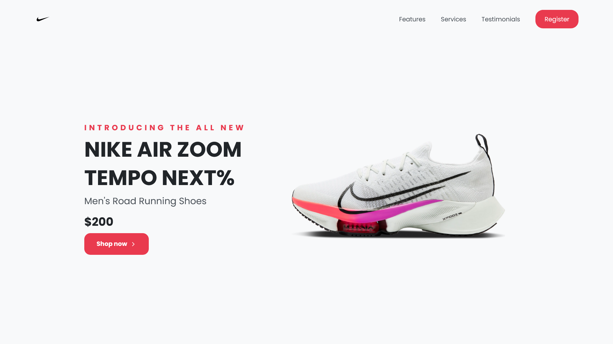

# Footwear Landing Page

<div align='center'>

  


</div>



This is a responsive static landing page for a footwear brand.

You can view the live site -> [here](https://footwear-landing-page.netlify.app/)

## Usage

This landing page is designed and developed by me to showcase a footwear brand's products and encourage users to contact the company. It is fully responsive and can be viewed on a desktop, tablet, and mobile devices. Through DOM manipulation and the Intersection Observer API, I was able to achieve these features:

- Modal window pop-up
- Smooth page scrolling
- Sticky navigation
- Reveal on scroll effect
- Image lazy loading
- Tabbed component
- Slider component

## Technologies Used

- HTML5
- CSS3
- JavaScript

## Installation

To run this project locally, you can follow these steps:

1. Clone the repository:

   ```
   $ git clone https://github.com/imadosan/footwear-landing-page.git
   ```

2. Open the project folder in your code editor of choice.
3. Open the 'index.html' file in your web browser.

## Credits

A big shoutout to [treetop](https://www.figma.com/community/file/883778082594341562/Free-75%2B-illustrations---Surface-Pack) for their incredible talent and generous spirit in providing the community with amazing illustrations free of charge!

## License

This project is licensed under the MIT License.

## Contact

If you have any questions or comments about this project, you can reach out to me at imad.fayad.if@gmail.com
